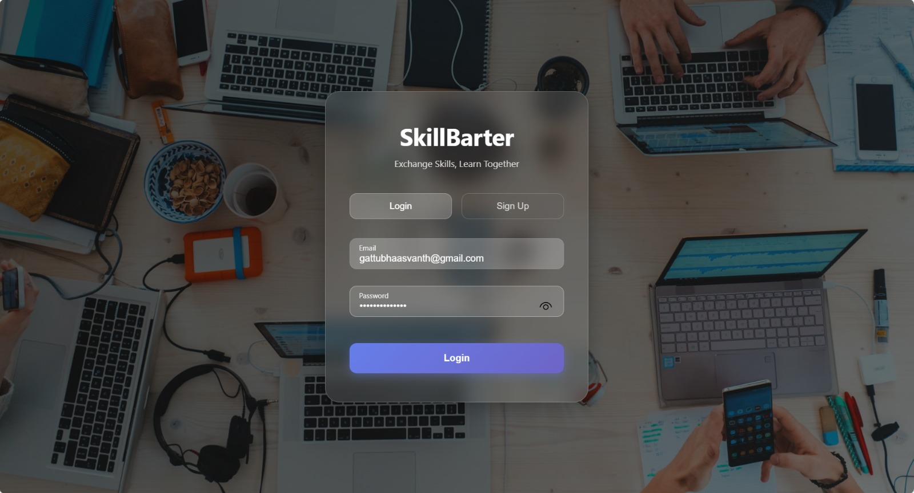
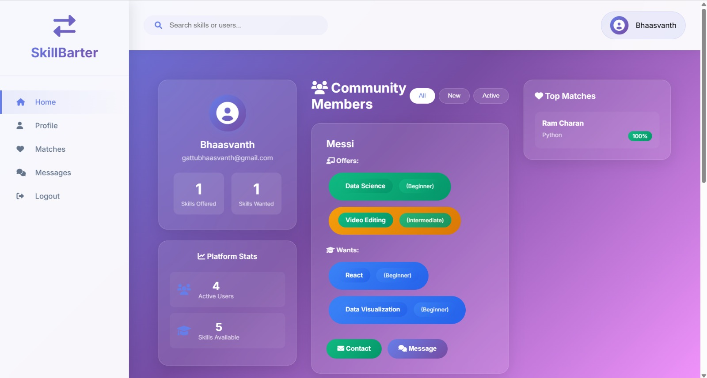
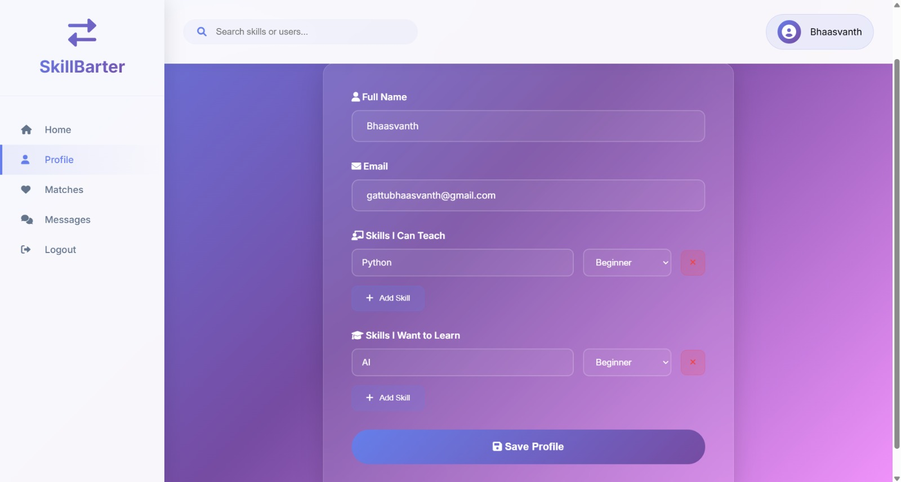
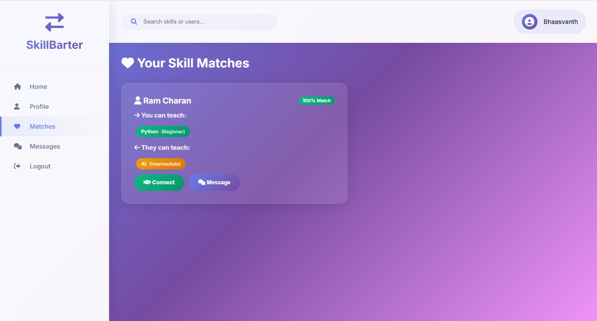
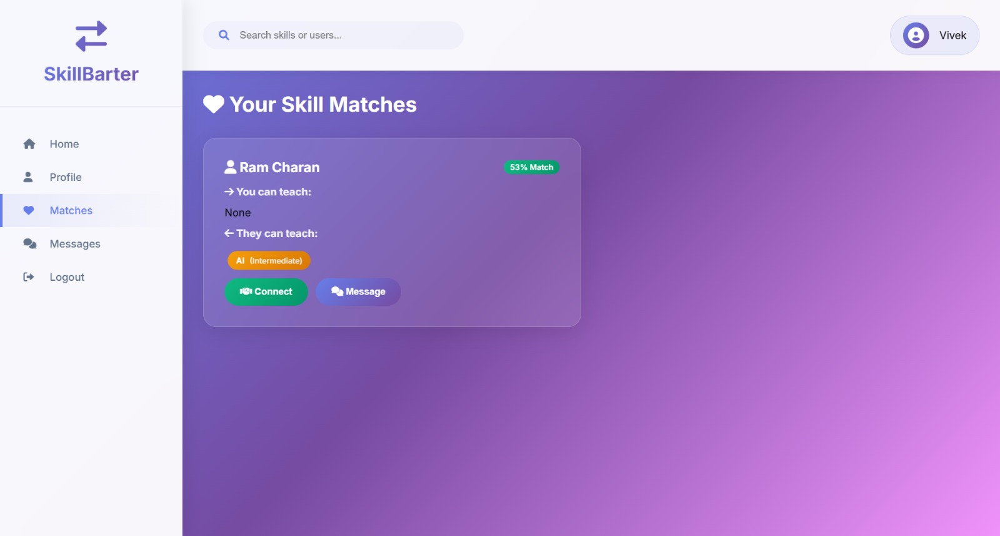
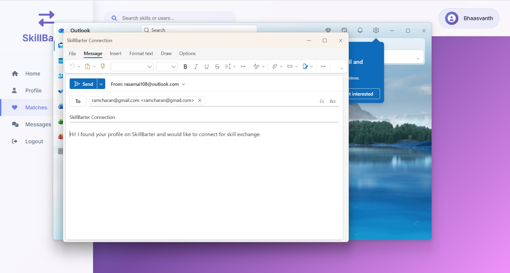
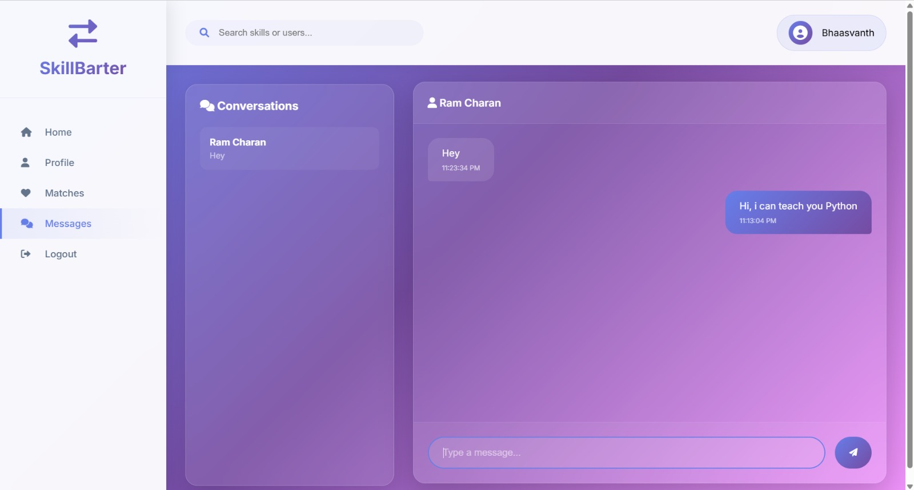

# SkillBarter - Project Overview

## 📋 Project Description

**SkillBarter** is a modern web-based skill exchange platform that connects people who want to teach skills with those who want to learn. Users can offer their expertise in exchange for learning new skills from others, creating a collaborative learning community.

---

## 🎯 Core Features

### 1. **User Authentication**
- Email/password signup and login
- Firebase Authentication integration
- Secure session management
- Auto-redirect for authenticated users
- Smooth page transitions (fade-out/fade-in effects)

### 2. **Skill Management System**
- Add multiple skills with proficiency levels:
  - **Beginner** (Green badge)
  - **Intermediate** (Orange badge)
  - **Expert** (Purple badge)
- Dynamic skill input fields (add/remove)
- Separate lists for "Skills Offered" and "Skills Wanted"

### 3. **Smart Matching Algorithm**
- Finds users with complementary skills
- Calculates match percentage based on:
  - Skill overlap
  - Proficiency level compatibility
  - Bonus scoring system:
    - Expert teaching Beginner: +10 points
    - Same level learning together: +3 points
    - Lower level teaching higher: +1 point
- Displays top 5 matches on dashboard

### 4. **Real-Time Messaging**
- In-app chat system
- Real-time message delivery via Firestore
- Conversation history
- Unread message indicators
- Message timestamps

### 5. **Community Feed**
- Browse all registered users
- View user profiles with skills
- Contact via email or in-app messaging
- Filter options (All/New/Active)

### 6. **Dashboard Layout**
- **3-Column Grid Design:**
  - Left: Profile summary with quick stats
  - Center: Community feed with user cards
  - Right: Top matches sidebar
- Platform statistics (total users, skills, matches)
- Responsive design for all screen sizes

---

## 🛠️ Technology Stack

### **Frontend**
- **HTML5** - Structure
- **CSS3** - Styling with advanced features:
  - Glassmorphism effects
  - Backdrop filters
  - CSS animations & transitions
  - Gradient backgrounds
  - Flexbox & Grid layouts
- **JavaScript (ES6+)** - Logic & interactivity
- **Font Awesome** - Icons
- **Google Fonts (Inter)** - Typography

### **Backend & Database**
- **Firebase Authentication** - User management
- **Cloud Firestore** - NoSQL database for:
  - User profiles
  - Skills data
  - Messages
  - Real-time synchronization

---

## 📁 File Structure

```
AD Project/
│
├── login.html              # Login/Signup page
├── login.css               # Login page styles (glassmorphism)
├── login.js                # Authentication logic
│
├── index.html              # Main dashboard page
├── style.css               # Dashboard styles & animations
├── script.js               # Core app logic & Firebase operations
│
└── firebase-config.js      # Firebase project configuration
```

---

## 🎨 Design Features

### **Login Page**
- Full-screen background image with dark overlay
- Glassmorphism card with blur effect
- Floating Material Design labels
- Animated gradient buttons
- Tab switching (Login/Signup)
- Smooth fade-out transition on success

### **Dashboard**
- Purple gradient background
- Glass-morphic cards throughout
- Fade-in-up animations for cards
- Skeleton loaders during data fetch
- Hover effects with elevation
- Color-coded skill level badges
- Smooth section transitions

### **Animations**
- Page transitions (0.6s fade)
- Card entrance animations (staggered)
- Button press effects
- Hover transformations
- Shimmer loading states
- Message slide-in effects

---

## 💾 Data Structure

### **User Document (Firestore)**
```javascript
{
  uid: "firebase_user_id",
  name: "John Doe",
  email: "john@example.com",
  skillsOffered: [
    { name: "Python", level: "Expert" },
    { name: "JavaScript", level: "Intermediate" }
  ],
  skillsWanted: [
    { name: "Guitar", level: "Beginner" }
  ],
  createdAt: timestamp
}
```

### **Message Document (Firestore)**
```javascript
{
  senderId: "user_id_1",
  receiverId: "user_id_2",
  text: "Hello!",
  timestamp: 1234567890,
  read: false,
  participants: ["user_id_1", "user_id_2"]
}
```

---

## 🔐 Security

- Firebase Authentication for secure login
- Firestore security rules:
  - Users can only edit their own profiles
  - Messages readable only by sender/receiver
  - All users can read public profiles
- No sensitive data stored in frontend
- Password validation (min 6 characters)

---

## 🚀 How It Works

### **User Flow**
1. User opens `login.html`
2. Signs up with email/password
3. Firebase creates account & user document
4. Redirects to `index.html` with fade transition
5. User completes profile with skills
6. System finds matches automatically
7. User can browse community & send messages
8. Real-time updates via Firestore listeners

### **Matching Logic**
1. Compare user's offered skills with others' wanted skills
2. Compare user's wanted skills with others' offered skills
3. Calculate base score from overlap
4. Add level bonuses for optimal teaching pairs
5. Sort by highest match percentage
6. Display top matches

---

## 📱 Responsive Design

- **Desktop (1200px+)**: Full 3-column layout
- **Tablet (768px-1200px)**: Single column, hidden sidebars
- **Mobile (<768px)**: Stacked layout, optimized touch targets

---

## 🎯 Key Highlights

✅ **No Server Required** - Runs directly from files using Firebase  
✅ **Real-Time Updates** - Instant message delivery & data sync  
✅ **Modern UI/UX** - Glassmorphism, animations, smooth transitions  
✅ **Smart Matching** - Algorithm considers skill levels for better pairs  
✅ **Scalable** - Firebase handles unlimited users  
✅ **Secure** - Firebase Authentication & Firestore rules  
✅ **Professional Design** - SaaS-grade interface with attention to detail  

---

## 🔧 Setup Requirements

1. Firebase project with:
   - Authentication enabled (Email/Password)
   - Firestore Database created
   - Security rules configured
2. Modern web browser (Chrome, Firefox, Edge)
3. Internet connection (for Firebase)

---

## 📊 Project Statistics

- **Total Files**: 7
- **Lines of Code**: ~2,500+
- **CSS Animations**: 15+
- **Firebase Collections**: 2 (users, messages)
- **Main Features**: 6
- **Design System**: Glassmorphism + Gradient

---


## 📸 Project Preview

### 🔐 Login Page


### 🏠 Community Dashboard


### 👤 Profile & Skill Management


### 💯 Perfect Skill Match


### 📊 Partial Skill Match


### 📧 Email Connection Feature


### 💬 Real-Time Messaging


---

## 🎓 Learning Outcomes
This project demonstrates:
- Firebase integration (Auth + Firestore)
- Modern CSS techniques (glassmorphism, animations)
- Real-time database operations
- Complex matching algorithms
- Responsive web design
- User authentication flows
- State management in vanilla JavaScript
- Professional UI/UX design patterns

---

## 🚀 Future Enhancement Ideas

- User profile pictures
- Skill categories/tags
- Video call integration
- Rating & review system
- Skill verification badges
- Advanced search filters
- Notification system
- Mobile app version
- Social media integration
- Skill exchange scheduling

---

## 📄 License

This is an educational project built for learning purposes.

---

**Built with ❤️ using Firebase, HTML, CSS, and JavaScript**
